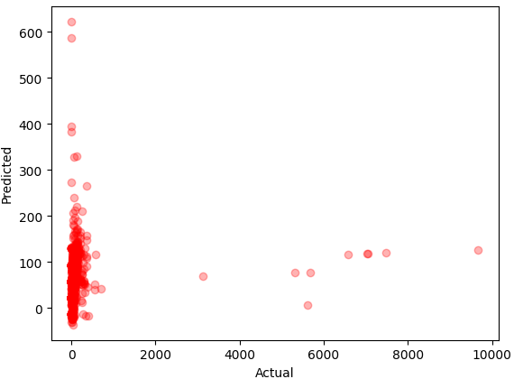

# 🏡 House Price Prediction using Machine Learning 🏠📊

## 🚀 Overview  
This project applies **Linear Regression** to predict **house prices in Nashik** based on multiple features.  

## 📂 Dataset Details 
📌 **Download Dataset:** [Click here](https://drive.google.com/drive/folders/1_0szBFlvP4pQE88_2xaC1OqQwkkowNy-?usp=sharing)     
📊 **Features:** BHK,	price,	per_month_emi,	total_sqft,	latitude,	longitude. 
📁 **Format:** CSV  

## 🎯 Machine Learning Model  
✅ **Algorithm Used:** Linear Regression 📈  
✅ **Evaluation Metrics:** Mean Squared Error (MSE), R-Squared Score (R²)  

## 🛠️ Technologies Used  
🔹 **Python Libraries:** Pandas, NumPy, Scikit-Learn, Matplotlib  
🔹 **ML Techniques:** Data Preprocessing, Feature Engineering, Model Evaluation  

## 🔥 Key Visualizations  
### 1️⃣ Actual vs Predicted Prices  
 

---

## 📢 Conclusion  
This project demonstrates the **power of Machine Learning in real estate pricing**.  
Future improvements could include **advanced ML models like Random Forest or XGBoost** for better accuracy.  

### 🔮 What’s Next?  
💡 Try different ML models (**Decision Tree, XGBoost**).  
💡 Deploy as a **web app** using Flask or Streamlit.  

---

## 👤 Author & Acknowledgments  
🚀 **Author:** Kirti Chaudhari  
📊 **Tools Used:** Python, Pandas, Scikit-Learn, Matplotlib  

📌 _If you found this useful, **drop a ⭐ star** on this repository!_ 🚀  
